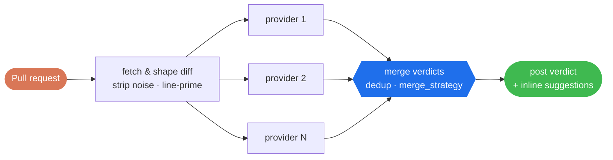

<div align="center">

# toolu-ghactions

### CI quality gates for AI-written code

Two GitHub Actions that carry [toolu](https://github.com/Falconiere/toolu)'s local quality discipline into CI: a multi-vendor **AI code reviewer** that audits every pull request and posts a machine-readable verdict, and a **Cloudflare Tunnel** action that exposes a runner port for live preview review.

[](https://github.com/Falconiere/toolu-ghactions/releases)
[](https://github.com/Falconiere/toolu-ghactions/actions/workflows/tests.yml)
[](#code-review)
[](./LICENSE)

[Overview](#overview) · [Actions](#actions) · [Usage](#usage) · [How it works](#how-it-works) · [Development](#development) · [Releases](#releases)

</div>

---

## Overview

AI coding agents open pull requests faster than human review scales. The discipline that catches swallowed errors, all-mock tests, hallucinated line numbers, and drifted docs lives in a reviewer's head — and it doesn't reach every PR on every repo.

**Problem** — review quality depends on who is looking and how much time they have. It is inconsistent, and it is the bottleneck.

**Approach** — pin the checklist, run it on the diff, make the verdict machine-readable. `code-review` audits each pull request against a fixed 7-dimension checklist (correctness, security, performance, test coverage, doc accuracy, tight assertions, migration warnings), optionally across an ensemble of up to 6 vendors voting in parallel. It posts one structured comment ending in `` `agent-merge-approved` `` / `` `agent-request-changes` `` — the format [`pr-babysit`](https://github.com/Falconiere/toolu/tree/main/plugins/pr-babysit) already consumes — alongside inline, committable suggestions. Advisory by design: findings never hard-block, CI stays green.

## Actions

| | Action | What it does | Sub-actions |
|---|---|---|---|
| 🔍 | [**code-review**](./code-review/README.md) | AI pull-request review against a 7-dimension checklist across up to 6 vendors (OpenRouter, OpenAI, Anthropic, DeepSeek, Moonshot, MiniMax). Posts a structured verdict and inline suggestions. | — |
| 🌐 | [**cloudflare-tunnel**](./cloudflare-tunnel/README.md) | Expose a runner port to the public internet through a Cloudflare Tunnel — quick or named — for live preview and visual review. | `start` · `stop` · `wait` |

Each action is self-contained and independently versioned; take both or lift one.

## Usage

### code-review

Add the workflow and an OpenRouter key:

```yaml
name: Code Review
on:
  pull_request:
    types: [opened, synchronize, ready_for_review, reopened]

jobs:
  review:
    runs-on: ubuntu-latest
    permissions:
      contents: read
      pull-requests: write
      issues: write
    steps:
      - uses: actions/checkout@v4
        with:
          fetch-depth: 0
      - uses: falconiere/toolu-ghactions/code-review@v2
        with:
          OPENROUTER_API_KEY: ${{ secrets.OPENROUTER_API_KEY }}
```

Multi-provider ensembles, merge strategies, custom checklists, and the full inputs table → **[`code-review/README.md`](./code-review/README.md)**.

### cloudflare-tunnel

```yaml
- uses: falconiere/toolu-ghactions/cloudflare-tunnel/start@v2
  id: tunnel
  with:
    port: 3000
- run: echo "Live at ${{ steps.tunnel.outputs.tunnel-url }}"
```

Named tunnels, outputs, and troubleshooting → **[`cloudflare-tunnel/README.md`](./cloudflare-tunnel/README.md)**.

## How it works

`code-review` runs a **fan-out → merge → post** pipeline. Each provider reviews the diff independently; a deterministic merger (no LLM) combines the verdicts and posts a single comment.



1. **Fetch & shape** — resolve the merge-base, strip noise (lockfiles, minified, generated, source maps), drop binaries, and prime every diff line with its real source line number so findings anchor to actual lines.
2. **Parallel reviews** — one review per provider against the full checklist. Findings are validated per-provider; hallucinated line numbers and low-confidence findings are dropped before the merge.
3. **Merge** — a deterministic merger dedups findings by `(path, line, end_line, fingerprint)`, keeps the highest severity, and sets the final verdict per `merge_strategy` (`conservative` / `majority` / `all_approve`).
4. **Post** — a summary verdict comment carrying the machine-readable label, plus per-line review comments with committable suggestions via the GitHub Reviews API.

## Marketplace

Each action is listed on the GitHub Marketplace from its own mirror repo — [`toolu-code-review`](https://github.com/Falconiere/toolu-code-review) and [`toolu-cloudflare-tunnel`](https://github.com/Falconiere/toolu-cloudflare-tunnel) — because the Marketplace lists one root-`action.yml` action per repository and never a subdirectory. The mirrors are **generated from this monorepo on each release** by the `mirror` job in [`release.yml`](.github/workflows/release.yml); edit here, not there. This repo stays canonical: the `falconiere/toolu-ghactions/<action>@v2` paths above are the recommended way to consume the actions.

## Repository structure

```
.
├── code-review/            # AI code review action
│   ├── action.yml
│   ├── Dockerfile
│   ├── src/                # fetch-diff → build-prompt → providers/<name>/ → merge → post
│   ├── prompts/            # Default review checklist
│   └── __tests__/          # Hermetic bats test suite
├── cloudflare-tunnel/      # Cloudflare Tunnel action
│   ├── start/ stop/ wait/  # Composite sub-actions (run on the runner host)
│   ├── src/                # start.sh / stop.sh / wait.sh / install-cloudflared.sh
│   └── __tests__/          # Hermetic bats test suite
├── scripts/                # Shared helpers (parse-verdict.sh, capture-fixtures.sh)
└── docs/toolu/             # Design specs and build plans
```

Actions share conventions and utilities so new ones drop in with the same structure.

## Development

```bash
# Run all test suites (119 tests; requires bats, jq, git)
bats code-review/__tests__/*.bats cloudflare-tunnel/__tests__/*.bats scripts/__tests__/*.bats

# Build the Docker image (code-review)
docker build -t code-review-action:test code-review/

# Lint all shell scripts (warnings and above block CI)
shellcheck --severity=warning code-review/src/*.sh cloudflare-tunnel/src/*.sh scripts/*.sh

# Validate action.yml against GitHub's schema
npx @action-validator/cli code-review/action.yml
```

Tests are hermetic — recorded fixtures for provider responses, mocked `curl` for GitHub API calls. No API key needed for the unit suite. See **[CONTRIBUTING.md](./CONTRIBUTING.md)**.

## Releases

Fully automated via [release-please](https://github.com/googleapis/release-please) — a release is cut on every push to `main` when conventional-commit changes are detected.

- **Commit convention** — [Conventional Commits](https://www.conventionalcommits.org/): `fix:` → patch, `feat:` → minor, `feat!:` / `fix!:` → major. `docs:` / `chore:` / `test:` / `ci:` → changelog only.
- **release-please PR** — opened and updated on each push to `main` with the version bump and changelog.
- **Merge it** — triggers `release.yml`: tags the release, publishes a GitHub Release, and force-moves the floating major alias (`v2` → latest `v2.x.y`).

Pin `@v2` for the floating major (**recommended**), or `@v2.0.0` for exact semver. Force a bump with `Release-As: X.Y.Z` in a commit footer.

## License

MIT — see [LICENSE](./LICENSE).
