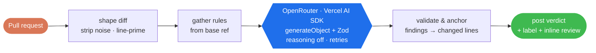

<div align="center">

# toolu-ghactions

### CI quality gates for AI-written code

GitHub Actions that carry [toolu](https://github.com/Falconiere/toolu)'s local quality discipline into CI: an **AI code reviewer** that audits every pull request and posts a machine-readable verdict, a **Cloudflare Tunnel** action that exposes a runner port for live preview review, and an **Expo Android builder** that builds and releases Expo apps with no Expo/EAS account.

[](https://github.com/Falconiere/toolu-ghactions/releases)
[](https://github.com/Falconiere/toolu-ghactions/actions/workflows/tests.yml)
[](#code-review)
[](./LICENSE)

[Overview](#overview) · [Actions](#actions) · [Usage](#usage) · [How it works](#how-it-works) · [Development](#development) · [Releases](#releases)

</div>

---

## Overview

AI coding agents open pull requests faster than human review scales. The discipline that catches swallowed errors, all-mock tests, hallucinated line numbers, and drifted docs lives in a reviewer's head — and it doesn't reach every PR on every repo.

**Problem** — review quality depends on who is looking and how much time they have. It is inconsistent, and it is the bottleneck.

**Approach** — pin the checklist, run it on the diff, make the verdict machine-readable. `code-review` audits each pull request against a fixed 8-dimension checklist (correctness, security, performance, test coverage, doc accuracy, tight assertions, migration warnings, and adherence to the project's own convention files), running one model through [OpenRouter](https://openrouter.ai) via the [Vercel AI SDK](https://sdk.vercel.ai) — structured output and retries, not free-text parsing. It posts one structured comment ending in `` `merge-approved` `` / `` `request-changes` `` — the format [`pr-babysit`](https://github.com/Falconiere/toolu/tree/main/plugins/pr-babysit) already consumes — alongside inline, committable suggestions. Advisory by design: findings never hard-block, CI stays green.

## Actions

| | Action | What it does | Sub-actions |
|---|---|---|---|
| 🔍 | [**code-review**](./code-review/README.md) | AI pull-request review against an 8-dimension checklist, running one model via OpenRouter (any OpenAI-compatible id) or the native DeepSeek API, on the Vercel AI SDK. Posts a structured verdict and inline suggestions. | — |
| 🌐 | [**cloudflare-tunnel**](./cloudflare-tunnel/README.md) | Expose a runner port to the public internet through a Cloudflare Tunnel — quick or named — for live preview and visual review. | `start` · `stop` · `wait` |
| 📱 | [**expo-builder**](./expo-builder/README.md) | Build signed Expo Android APK/AABs with `expo prebuild` + Gradle — **no Expo/EAS account, no eas-cli** — and ship them to GitHub Releases or a Google Play track. | `build-android` · `deploy-github-release` · `deploy-google-play` |

Each action is self-contained and independently versioned; take both or lift one.

## Usage

### code-review

Add the workflow and an OpenRouter key:

```yaml
name: Code Review
on:
  pull_request:
    types: [opened, synchronize, ready_for_review, reopened]

jobs:
  review:
    runs-on: ubuntu-latest
    permissions:
      contents: read
      pull-requests: write
      issues: write
    steps:
      - uses: actions/checkout@v4
        with:
          fetch-depth: 0
      - uses: falconiere/toolu-ghactions/code-review@v4
        with:
          API_KEY: ${{ secrets.OPENROUTER_API_KEY }}
```

Model selection, custom checklists, project-convention scanning, and the full inputs table → **[`code-review/README.md`](./code-review/README.md)**.

### cloudflare-tunnel

```yaml
- uses: falconiere/toolu-ghactions/cloudflare-tunnel/start@v2
  id: tunnel
  with:
    port: 3000
- run: echo "Live at ${{ steps.tunnel.outputs.tunnel-url }}"
```

Named tunnels, outputs, and troubleshooting → **[`cloudflare-tunnel/README.md`](./cloudflare-tunnel/README.md)**.

### expo-builder

```yaml
- uses: falconiere/toolu-ghactions/expo-builder/build-android@v6
  id: build
  with:
    format: both
    keystore-base64: ${{ secrets.ANDROID_KEYSTORE_BASE64 }}
    keystore-password: ${{ secrets.ANDROID_KEYSTORE_PASSWORD }}
    key-alias: ${{ secrets.ANDROID_KEY_ALIAS }}
    key-password: ${{ secrets.ANDROID_KEY_PASSWORD }}
- uses: falconiere/toolu-ghactions/expo-builder/deploy-github-release@v6
  with:
    app-version: ${{ steps.build.outputs.app-version }}
    files: |
      ${{ steps.build.outputs.apk-path }}
      ${{ steps.build.outputs.aab-path }}
```

All inputs/outputs, signing setup, and the account-free rationale → **[`expo-builder/README.md`](./expo-builder/README.md)**.

## How it works

`code-review` runs a **shape → review → post** pipeline. One model reviews the diff via OpenRouter (default) or the native DeepSeek API; the SDK returns a Zod-validated verdict, which the action anchors to real lines and posts as a single comment.



1. **Shape the diff** — resolve the merge-base (deepening a shallow checkout if needed), strip noise (lockfiles, minified, generated, source maps, `dist/`/`build/` output, and anything detected as generated by content — a line over 5000 chars or a blob over 1MB), drop binaries, and prime every diff line with its real source line number so findings anchor to actual lines.
2. **Gather rules** — read the repo's own convention files **from the base ref** (injection-safe) and fold them into the prompt as the convention-adherence dimension.
3. **Review** — build the system + user prompt and call the configured model — OpenRouter or the native DeepSeek API — via the Vercel AI SDK (`generateObject` + a Zod schema). Output is structured by construction with automatic retries; reasoning is disabled on both backends (it is billed against `MAX_TOKENS`, so a thinking model spends the budget before emitting any JSON). A response the schema rejects is recovered where it honestly can be — findings completed before a truncation cut, or a complete response normalized back onto the schema — and only when nothing trustworthy survives does it surface an `error` verdict (never a silent null).
4. **Validate & anchor** — drop hallucinated line numbers and low-confidence findings, dedup by `(path, line, end_line, fingerprint)`, and anchor each finding to a real changed line.
5. **Post** — a summary verdict comment carrying the machine-readable label and a matching PR label chip, plus per-line review comments with committable suggestions via the GitHub Reviews API.

## Marketplace

Each action is listed on the GitHub Marketplace from its own mirror repo — [`toolu-code-review`](https://github.com/Falconiere/toolu-code-review) and [`toolu-cloudflare-tunnel`](https://github.com/Falconiere/toolu-cloudflare-tunnel) — because the Marketplace lists one root-`action.yml` action per repository and never a subdirectory. The mirrors are **generated from this monorepo on each release** by the `mirror` job in [`release.yml`](.github/workflows/release.yml) — for `code-review` that copies the action source **including the bundled `dist/`**, so the mirror runs as the same node24 JS action with identical inputs/outputs. Edit here, not there. This repo stays canonical: the `falconiere/toolu-ghactions/<action>@v2` paths above are the recommended way to consume the actions.

## Repository structure

```
.
├── code-review/            # AI code review action (TypeScript, node24 JS action)
│   ├── action.yml          # runs: node24 · main: dist/index.cjs
│   ├── dist/index.cjs       # Bundled entrypoint (committed; built by build.mjs)
│   ├── src/                # main → inputs → git/ → rules → prompt → llm/ → review/ → github/
│   ├── prompts/            # Default review checklist
│   └── __tests__/          # vitest suite (real recorded fixtures, no mocks)
├── cloudflare-tunnel/      # Cloudflare Tunnel action
│   ├── start/ stop/ wait/  # Composite sub-actions (run on the runner host)
│   ├── src/                # start.sh / stop.sh / wait.sh / install-cloudflared.sh
│   └── __tests__/          # Hermetic bats test suite
├── expo-builder/           # Expo Android build + release (no EAS account)
│   ├── build-android/      # Composite: prebuild → init-script signing → Gradle
│   ├── deploy-github-release/  # Composite: gh release + sha256sums.txt
│   └── __tests__/          # Shared bats helpers (per-sub-action suites)
├── scripts/                # Shared helpers (parse-verdict.sh, mirror-action.sh)
└── docs/toolu/             # Design specs and build plans
```

`code-review` is a bundled JS action (no Docker image); `cloudflare-tunnel` is a composite action. Each is self-contained.

## Development

`code-review` is a TypeScript node24 action — type-check, test, and bundle it:

```bash
cd code-review
npm ci
npx tsc --noEmit        # type-check
npx vitest run          # tests (real recorded fixtures, no mocks)
node build.mjs          # bundle src/ → dist/index.cjs (commit the result)
```

`cloudflare-tunnel` (and the shared `scripts/`) is still bash — test and lint it with bats + shellcheck:

```bash
# Run the bash suites (requires bats, jq, git)
bats cloudflare-tunnel/__tests__/*.bats scripts/__tests__/*.bats expo-builder/*/__tests__/*.bats

# Lint shell scripts (warnings and above block CI)
shellcheck --severity=warning cloudflare-tunnel/src/*.sh scripts/*.sh expo-builder/*/src/*.sh

# Validate action.yml against GitHub's schema
npx @action-validator/cli code-review/action.yml cloudflare-tunnel/*/action.yml expo-builder/*/action.yml
```

`code-review` tests use **real recorded fixtures** (OpenRouter + native DeepSeek responses, GitHub API payloads, real git repos) — no mocks, no API key needed. A CI check rebuilds `dist/` and fails if the committed bundle has drifted. See **[CONTRIBUTING.md](./CONTRIBUTING.md)**.

## Releases

Fully automated via [release-please](https://github.com/googleapis/release-please) — a release is cut on every push to `main` when conventional-commit changes are detected.

- **Commit convention** — [Conventional Commits](https://www.conventionalcommits.org/): `fix:` → patch, `feat:` → minor, `feat!:` / `fix!:` → major. `docs:` / `chore:` / `test:` / `ci:` → changelog only.
- **release-please PR** — opened and updated on each push to `main` with the version bump and changelog.
- **Merge it** — triggers `release.yml`: tags the release, publishes a GitHub Release, and force-moves the floating major alias (`v2` → latest `v2.x.y`).

Pin `@v2` for the floating major (**recommended**), or `@v2.0.0` for exact semver. Force a bump with `Release-As: X.Y.Z` in a commit footer.

> **v2 — `code-review` is now a TypeScript JS action.** The reviewer was rewritten
> from a Dockerized bash action into a bundled node24 JavaScript action
> (`runs: node24`, `main: dist/index.cjs`). This is a **breaking packaging change**
> with **no contract change** — every `action.yml` input and output name and
> default is preserved, so existing `@v2` workflows keep working untouched. The
> practical win: because consumers run the checked-out ref directly (no Docker
> image to rebuild and re-push), **a fix lands on `@v2` the moment it merges** — no
> release required to get it. release-please still cuts tagged releases and mirrors
> for changelog and Marketplace purposes.

## License

MIT — see [LICENSE](./LICENSE).
