# code-review pipeline architecture

A map of the review pipeline for a fresh session: what calls what, in what
order, what each module owns, and what happens when something fails. This is
navigation, not rationale — the *why* behind each layer lives in
`docs/toolu/specs/2026-08-07-size-proof-code-review-design.md` (design) and
`docs/toolu/plans/2026-08-07-size-proof-code-review.md` (landed steps +
`## Deviations`, which is authoritative over the spec where the two disagree).
For user-facing behavior (inputs, comment shapes, triggers) see `../README.md`.

Four deterministic-first layers replace the old flat "chunk everything" review:
code does all the collapsing, grouping, clustering, and coverage accounting;
the LLM is called only where judgment lives (the intent brief, per-package
review). Anything not *provably* mechanical falls through to a real review —
degradation spends tokens, never coverage.

## Pipeline

```mermaid
flowchart TD
    FD["fetchDiff\n(git/diff.ts, git/batchRead.ts)"] --> SC["resolveTreeScope + filterDiffToScope\n(pipeline/scope.ts)"]
    SC --> L0["Layer 0 — distill()\n(git/distill.ts, git/patterns.ts)"]
    L0 --> L1["Layer 1 — mapPr()\n(review/cartographer.ts)"]
    L1 --> PK["groupByBrief\n(pipeline/packages.ts)"]
    PK --> L2["Layer 2 — reviewChunked() / reviewPackage()\n(review/chunked.ts, review/bisect.ts, llm/reviewWithModel.ts)"]
    L2 --> MG["mergeResults()\n(llm/merge.ts)"]
    MG --> VAL["validateFindings + fingerprint\n(review/validate.ts, state.ts)"]
    VAL --> L3["Layer 3 — reduceFindings()\ncarryForward + clusterFindings\n(pipeline/reduce.ts, pipeline/carry.ts, review/cluster.ts)"]
    L3 --> ST["settleVerdict\n(pipeline/settle.ts)"]
    ST --> RC["reconcile()\n(review/reconcile.ts)"]
    RC --> PI["postInlineReview + postComments\n(github/review.ts, github/reviewBatch.ts)"]
    PI --> RD["renderLedger + renderBody + fitToSizeLimit\n(review/ledger.ts, review/render.ts, review/sections.ts, review/verdict.ts)"]
    RD --> MK["diffState + encodeMarker → sticky comment\n(state.ts)"]
    MK --> RP["reportRun (best-effort)\n(report/expand.ts, report/partition.ts, report/report-run.ts)"]
```

Orchestration entry point: `runReview()` in `src/pipeline.ts`. It wires the
diagram above in exactly this order: `fetchDiff` → `resolveTreeScope` /
`filterDiffToScope` → `reviewAndValidate()` (`src/pipeline/reviewCall.ts`,
which itself runs `distill()` → `mapPr()` → `reviewChunked()`) → `publish()`
(`src/pipeline/publish.ts`, which runs `reduceFindings()` → `settleVerdict()`
→ inline-thread `reconcile()`/posting → sticky comment → label →
`reportRun()`).

**Data flow:** `DiffData` → `Distillation` (strata + pattern groups + shrunk
`review_diff`) → `Brief | null` → packages (`FileSegment[][]`) →
`ProviderResult[]` merged to one → validated/stamped `Finding[]` → clusters
(`FindingCluster[]`, representatives + members) → publish (inline threads +
sticky comment) + marker (`ReviewState`, persisted in the sticky comment).

## Module map

Every path below is verified to exist; the one-liner is what that file's own
header comment says it owns (not the spec's original intent — read the file
header for the full story, this is just the index).

### `src/git/`
- **`distill.ts`** — Layer 0: zero-token diff classification (one `Stratum`
  per changed path: `substantive`/`pattern`/`rename`/`formatting`/`vendored`/
  `generated`), a shrunk `review_diff` (exemplars + substantive only), the
  per-path `manifest`, and `rules_changed`. At most one subprocess (batched
  `git check-attr`) — rename/formatting/pattern classification is derived
  from the diff text already in hand, never re-resolved against git.
- **`patterns.ts`** — pure string work (no git, no I/O): finds sets of files
  whose hunk bodies are byte-identical once per-file coordinates are
  normalized away, feeding `distill()`'s pattern groups.
- **`batchRead.ts`** — one `git cat-file --batch-check` (sizes) + one bounded
  `git cat-file --batch` (≤64 KiB/blob) replacing the per-file `git show`/
  `cat-file -s` spawns `classifyFiles` used to run once per changed file.

### `src/review/`
- **`cartographer.ts`** — Layer 1: one small, fail-open `generateObject` call
  over the **manifest only** (never diff text) producing the shared `Brief`
  (`intent`, `global_facts`, `package_hints`). `mapPr()` never throws — a
  rejected/timed-out/schema-invalid call just yields `null`.
- **`chunked.ts`** — Layer 2 driver: packs the (brief-hinted) diff into
  packages bounded by `MAX_CHUNK_LINES`, issues the first call alone as a
  prompt-cache warm-up then the rest at `CHUNK_CONCURRENCY`, reports
  `MAX_CHUNKS` spill as per-file `unreviewed`, and feeds every package's
  outcome through `onCoverage`.
- **`bisect.ts`** — reviews **one** package: on a `schema` failure, bisects
  (`BISECT_MAX_DEPTH=2`, ≤4 leaves, ≤7 calls total); `transport`/`timeout`
  failures never bisect (one classic retry instead — splitting a struggling
  provider's load would only make it worse). Reports per-path coverage for
  every outcome (`reviewed`/`unreviewed`/`pending`).
- **`cluster.ts`** — Layer 3 reducer: groups findings sharing category +
  near-identical `normText` across ≥3 distinct paths into one exemplar-led
  `FindingCluster`; the exemplar is pinned via `priorClusters` (prior
  exemplar if still present, else the lowest surviving member fp).
- **`ledger.ts`** — `CoverageStatus`/`CoverageEntry`/`CoverageLedger`;
  `buildRoundLedger()`'s fixed precedence (dropped/binary → carried →
  non-substantive stratum → Layer 2 outcome → `unreviewed (not-attempted)`
  as the loud default); `renderLedger()` is size-safe (counts always,
  exception rows capped at `LEDGER_MAX_ROWS=50`).
- **`reconcile.ts`** — decides `toCreate`/`toReply`/`toResolve` for the bot's
  prior inline threads against this round's findings (cluster
  representatives only — see `pipeline/reduce.ts`); cluster-aware coverage
  (any member fp matching a thread covers the whole cluster).
- **`render.ts`** — assembles the verdict-comment markdown body from a
  `ReviewBody` (findings, ledger, unanchored findings, cluster sections).
- **`sections.ts`** — renders the three size-capped sticky-comment sections
  split out of `render.ts`: `### Unanchored findings` (no anchor exists),
  `### Findings GitHub rejected inline` (422'd even isolated alone — the
  `InlineReviewResult.dropped` path), each ≤20 rows, and `### Repeated
  findings` (≤10 clusters, ≤10 members listed each).
- **`verdict.ts`** — verdict→label/badge mapping (`formatVerdict`) and the
  `fitToSizeLimit` shrink ladder: ledger exception rows → whole ledger
  section → findings (worst-severity-last), all ahead of ever dropping the
  recap/history/marker.

### `src/pipeline/`
- **`scope.ts`** — tree-based incremental scope: `resolveTreeScope()` turns
  the marker's `reviewed_tree` + exception paths into this round's in-scope
  file set via `git diff-tree`; fails open (full review) on no marker, a
  missing tree, or an unresolvable head.
- **`packages.ts`** — assigns the (already-distilled) diff's file segments to
  packages from the brief's `package_hints`, respecting module-coupled units
  (`groupRelatedSegments` fallback) and never letting one hint's group blow
  past the chunk-line budget as a single atomic package.
- **`carry.ts`** — strict carry-forward: re-injects the prior finding of
  every path whose ledger status is not `reviewed`, but only through a
  strict shape check (marker findings are attacker-influenceable
  `.passthrough()` data) — the rest are ledgered `carried` with no finding.
- **`reduce.ts`** — Layer 3 orchestration: `carryForward()` then
  `clusterFindings()`, producing the `Reduction` (`representatives`, cluster
  `ctx`, the marker's `clusters` map, `carriedFps`) that publish, reconcile,
  and the report all read.
- **`settle.ts`** — the verdict + marker decisions: drop out-of-scope /
  already-settled findings, apply the `MAX_ROUNDS` cap, degrade a would-be
  `approved` to `error` on any ledger `unreviewed`/`pending` entry
  (`degradeOnCoverage`), and build the marker via `diffState`
  (`renderMemory`).
- **`reviewCall.ts`** — the model-facing phase: wires `distill()` →
  `mapPr()` → `reviewChunked()` in that fixed order, validates + fingerprint
  stamps findings against the shrunk diff, and assembles this round's
  `CoverageLedger`.
- **`publish.ts`** — the publish orchestration, order load-bearing twice
  over: inline threads run **before** the sticky comment (so unanchored and
  dropped findings can be rendered into it), and the toolu.sh report runs
  **after** the inline mutations (so it never claims a fix GitHub didn't
  accept).

### `src/github/`
- **`review.ts`** — `postInlineReview()`: builds inline comments, validates
  every anchor against GitHub's own `pulls.listFiles` patches. **No
  file-level fallback** — an unanchorable finding is never posted; it comes
  back in `InlineReviewResult.unanchored` for the caller to render into the
  sticky comment.
- **`reviewBatch.ts`** — batches comments at `MAX_COMMENTS_PER_REVIEW=30`;
  a batch that 422s is bisected (poison-comment isolation) so the rest of
  the batch still posts; the isolated comment is returned in `dropped`.
- **`event.ts`** — normalizes a `pull_request` or `issue_comment` event into
  one `EventResolution`, including the `<TRIGGER_PHRASE> review` vs
  `<TRIGGER_PHRASE> resume` parse (same fail-closed permission gate for
  both).

### `src/llm/`
- **`reviewWithModel.ts`** — the provider-agnostic `generateObject` call
  (timeout/abort, retries, budget escalation, salvage, abstain). A failed
  call's error result carries `failure: "schema" | "transport" | "timeout"`
  so callers can tell a bisectable failure from one that isn't.
- **`merge.ts`** — combines a chunked review's per-package `ProviderResult`s
  into one: partial failure keeps every success and only reports `error`
  when **every** package failed.

### `src/state.ts`
- The sticky-comment marker: `fingerprint()`/`normText` (byte-compat,
  **never modified**), `encodeMarker`/`decodeMarker` (gzip+base64,
  fail-safe on a corrupt or hostile marker), and `diffState()` — the *sole*
  carrier of every marker field into `next_state`; a field not threaded
  through `DiffInput` here is dropped on the next round. See
  [Marker contract](#marker-contract-statets) below.

### `src/report/`
- **`expand.ts`** — `expandClusters()`: puts cluster **members** back in
  place of the exemplar **before** the report layer runs, on both this
  round's findings and every applied reconcile bucket, using the same map.
- **`partition.ts`** — `partitionFindings()`: turns the applied reconcile
  plan into four disjoint, exhaustive report buckets keyed by fingerprint;
  owns correctness itself rather than trusting `reconcile()`'s buckets to
  already be a partition.

## Failure modes

| Failure | Caught in | Behavior | Ledger / comment effect |
|---|---|---|---|
| Schema failure (model can't emit structured output for an envelope) | `review/bisect.ts` (`reviewPackage`) | Bisects the package (`BISECT_MAX_DEPTH=2`, ≤4 leaves, ≤7 calls total) instead of one flat retry — the split *is* the retry | Surviving leaves ledgered `reviewed`; a leaf that still fails is ledgered `unreviewed` **per file**, never a whole-chunk write-off |
| Transport / timeout failure | `review/bisect.ts` (never bisects for these causes) | One classic retry (today's pre-v7 behavior); splitting a struggling/rate-limited provider would only add load | Still failing after the retry → every file in the package ledgered `unreviewed` |
| Wall clock exceeded (`MAX_WALL_MS`) | `review/bisect.ts`/`review/chunked.ts` (`deadlinePassed`, checked before every package **and** every bisection split) | Remaining packages/halves are skipped outright, zero calls spent | Ledgered `pending`; `reviewed_tree` does **not** advance; marker persists `pending_paths`/`unreviewed_paths`; resumable via `@toolu resume`, a workflow re-run, or the PR's next push |
| Unanchorable finding (file has no `patch` in `listFiles`, or its line maps onto nothing GitHub shows) | `github/review.ts` (`fetchAnchorableLines`/`validateAnchor`) | Never posted inline — there is no file-level fallback (GitHub's Reviews API 422s a review containing even one such comment) | Returned in `InlineReviewResult.unanchored`; rendered in the sticky comment's `### Unanchored findings` section |
| Poison comment (a batch still 422s after anchor validation) | `github/reviewBatch.ts` (`postBatch`, recursive bisection) | Batch is bisected in half repeatedly until the poison comment is isolated alone; every sibling comment still posts | Isolated finding returned in `InlineReviewResult.dropped` (`pipeline/publish.ts`'s `postInline()` now threads it through) and rendered in the sticky comment's `### Findings GitHub rejected inline` section (`review/sections.ts`'s `buildDroppedSection`, placed right after `### Unanchored findings` in `render.ts`) — never silently lost |
| Cartographer (Layer 1) failure — reject, timeout, or schema-invalid brief | `review/cartographer.ts` (`mapPr`, never throws) | Returns `null`; Layer 2 proceeds with `brief: null` (envelopes simply omit the brief block) | No ledger effect — this is a quality-of-context loss, not a coverage loss |
| Marker's `reviewed_tree` missing, or the object no longer exists locally (e.g. a force-push that GC'd it) | `pipeline/scope.ts` (`resolveTreeScope`, `objectExists`) | Fails open to a **full review** of every changed path | No `carried` entries this round; the ledger reflects a normal full run |

## Marker contract (`state.ts`)

The sticky-comment marker (`ReviewState`, schema `version: 1`, additive —
zod strips unknown keys, so old code reading a new marker and new code
reading an old marker both work) carries:

| Field | Advanced by | Semantics |
|---|---|---|
| `findings` | every run | This round's full finding list (fingerprint-stamped), post-cluster-expansion. |
| `history` | **complete** runs only | Capped at the last 10 entries; a partial run appends **nothing**, so a resumed round never burns a `MAX_ROUNDS` slot. |
| `reviewed_sha` | **complete** runs only | Full head sha; drives the **line-level** `IncrementalScope` (`sinceChangedLines`, `pipeline/git.ts`). |
| `reviewed_tree` | **complete** runs only | Root **tree** sha; drives the **file-set** scope (`resolveTreeScope`, `pipeline/scope.ts`). Constant-size regardless of PR size. |
| `unreviewed_paths` | every run (threaded straight from the caller) | Attempted-and-failed paths this round; empty → **omitted** (an absent field is how a completing round clears the prior round's exceptions). |
| `pending_paths` | every run | Not-yet-attempted paths (wall-clock budget); same omit-when-empty rule. |
| `clusters` | every run | Member fp → exemplar fp, multi-member clusters only; persists cluster identity across rounds. |

**`diffState()` is the only carrier into `next_state`** — a new field not
threaded through `DiffInput` here is silently dropped on the next round; this
is the one place a future field addition must touch.

**The `complete` flag** (`DiffInput.complete`, set from
`pipeline/settle.ts`'s `ledgerExceptions()` — `true` iff the round's ledger
has zero `unreviewed` and zero `pending` entries) is the gate on everything
above: only a complete-coverage run advances `reviewed_sha`/`reviewed_tree`
and appends a history entry. A partial run (wall-clock budget, a resume still
in flight) preserves the **prior** `reviewed_sha`/`reviewed_tree` untouched
and updates only the exception lists — so the next round's incremental scope
always keys off the last head that was *fully* reviewed, never a
half-finished one, and the round counter keeps meaning "complete reviews".
